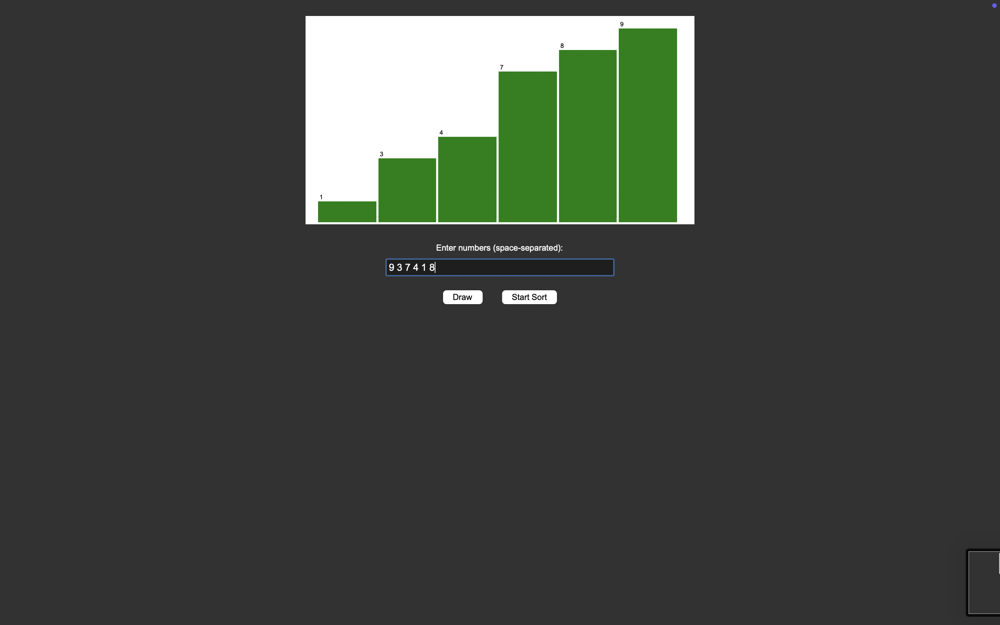

Quicksort Visualizer (Python + Tkinter)

This project is a visual demonstration of the Quicksort algorithm, built using Python Tkinter.
Users can enter their own numbers, draw bars, and watch the sorting process step-by-step with animations.

🚀 Features

🎨 Graphical visualization using Tkinter Canvas

🎯 User input supported (space-separated integers)

🔄 Real-time animation of:

Pivot element

Comparisons

Swaps

Final sorted state

🎨 Color-coded steps:

Orange → Pivot

Red → Swapping elements

Gray → Normal elements

Green → Fully sorted

📸 Screenshots

(Add your screenshots here)

🧠 How It Works

The visualizer uses the Lomuto partition scheme for Quicksort:

Pick the last element as pivot

Reorder elements around the pivot

Visualize every comparison and swap

Recursively sort left and right partitions

Animations are created using a delay (time.sleep) combined with bar redraws.

📥 How to Use

Run the Python script:

python quicksort_visualizer.py

Enter numbers (space separated), for example:

5 3 8 1 4 2

Click Draw to display the bars.

Click Start Sort to visualize the Quicksort process.

📦 Requirements

Make sure you have Python installed.

No external libraries required.
Tkinter comes bundled with standard Python installations.

📁 Project Structure
quicksort-visualizer/
│
├── quicksort_visualizer.py
├── README.md
└── images/ (optional for screenshots)

🧩 Code Overview
Main Components

draw_bars() → Draws array bars

animate() → Shows each sorting step

partition() → Lomuto partition logic

quicksort() → Recursive Quicksort

Tkinter UI: input box, draw button, sort button

🧑‍💻 Future Enhancements

Add speed control slider

Add multiple algorithms (Merge Sort, Heap Sort, Bubble Sort)

Step-by-step mode (Next Step button)

Dark mode UI

🏆 Author

Leela Sai Gottimukkala
Feel free to connect and contribute!
